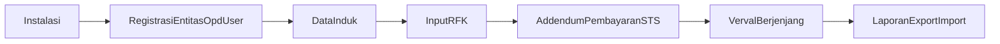
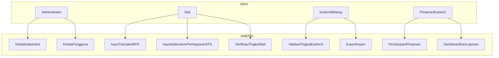
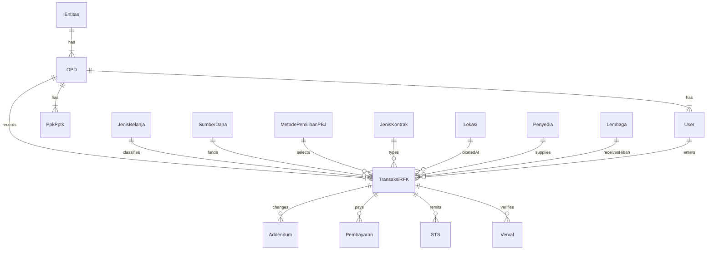
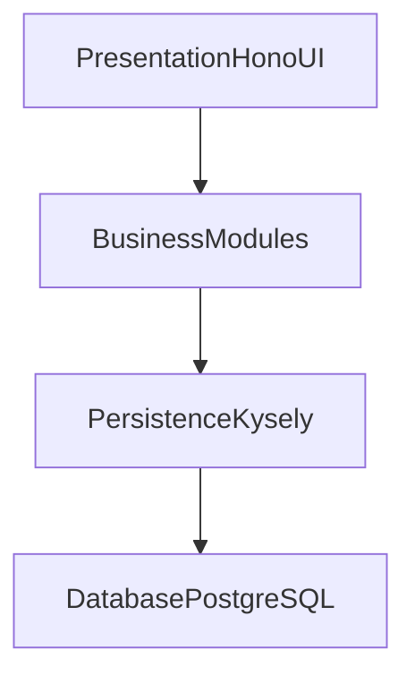
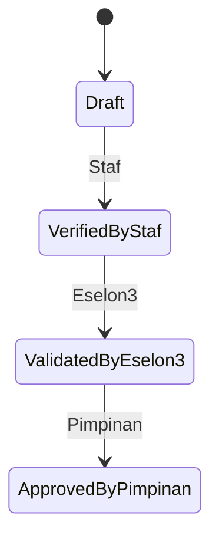

# SIREFIK

Sistem Informasi Realisasi Fisik dan Keuangan

This README follows the implementation brief in [issue.md](issue.md).

## What is SIREFIK

SIREFIK is a web application for Pemerintah Daerah, starting from Kabupaten Puncak Jaya. It records, verifies, and reports **realisasi fisik dan keuangan** of regional expenditure—especially contracted work packages—so Organisasi Perangkat Daerah (OPD) can replace manual Excel reporting.

It covers the path from master data (entitas, OPD, user, lokasi, sumber dana, kontrak/SPK) through execution (progress fisik, addendum, pembayaran, sanksi/STS, PHO/BAST) to hierarchical verification and periodic RFK reports. The aim is timely, accountable data for pimpinan and for audit of Laporan Realisasi Anggaran (LRA) / Laporan Keuangan Pemerintah Daerah (LKPD).

## Goal

Build a single web application that lets Pemda record, verify, and report physical and financial realization of regional expenditure, especially paket pekerjaan that already have a contract.

## Stack

- Runtime: Node.js
- HTTP framework: Hono
- Database: PostgreSQL
- Data access: Kysely
- Packaging: electron-builder

Do **not** use Laravel or PHP. Source documents may mention those; take business process, actors, entities, and reports from them. Do not take their technology choices.

## Phases

**Development.** Build and run the Hono web app as a Node.js project in this folder. In this same phase, use electron-builder to package the web app.

**Production.** The electron-builder artifact is a single `*.exe`. Running it installs (or starts) a local web server on the user's machine so each OPD user can use the web app without a shared remote host. This packages the Node.js + Hono app; it is not a Laravel/PHP rewrite.

## Language

The web app is **Indonesian only**. All UI copy, menus, forms, validation messages, dashboards, maps, reports, and exports must be Bahasa Indonesia. Do not add English UI, locale switching, or i18n. Code and identifiers may stay English; user-facing text must not.

## Architecture

Modular monolith: one deployable unit, internal source strictly split into independent, loosely coupled business modules. Modules talk through explicit module APIs, not deep cross-imports.

One app instance serves **one entitas**. Many OPD. Users belong to OPD/bidang.

### Modules

- **Identity** — users and roles: Administrator, Staf, Eselon 3 (bidang), Pimpinan (Eselon 2)
- **Organization** — entitas Pemda, OPD, PPK/PPTK
- **Catalog** — jenis belanja (three levels), sumber dana, metode pemilihan PBJ, jenis kontrak, lokasi (provinsi–kabupaten–distrik–desa + koordinat)
- **Parties** — penyedia/rekanan, lembaga penerima hibah, konsultan pengawas/MK
- **Rfk** — paket pekerjaan / transaksi RFK, addendum, pembayaran (termin), STS/denda, progress fisik, PHO/BAST
- **Verification** — berjenjang Staf → Eselon 3 → Pimpinan
- **Reporting** — dashboard, laporan RFK by kelompok belanja, peta lokasi, export/import

Plus a thin shared kernel (HTTP, auth context, database client). Each module owns its persistence. Kysely is the only data access path.

## Implementation steps

1. Bootstrap the Node.js + TypeScript project in this folder as one Hono web application. Do not scaffold Laravel or PHP.
2. Connect PostgreSQL and Kysely as the only data access path.
3. Split source into the business modules above plus the shared kernel.
4. Seed/pre-input master catalogs (jenis belanja, sumber dana, metode PBJ, jenis kontrak, wilayah).
5. Deliver identity and organization masters, then RFK transactions (kontrak, addendum, pembayaran, STS, prestasi fisik, PHO/BAST).
6. Deliver hierarchical verval and reporting (dashboard, map, export/import Excel/CSV/PDF).
7. Treat evidence uploads (kontrak, BAST, foto/video lokasi) as a first-class capability.
8. In development, use electron-builder to package the same Hono web app. Production output is a single `*.exe` that automatically installs a local web server so each OPD user can run the web app on their own machine.

## Business logic

### Business requirement flow

Instalasi and packaging produce a local web server. After that, the entitas registers OPD and users, fills master data, records RFK and supporting transactions, verifies in hierarchy, then reports.

### Use case diagram

- Administrator: manage users and all master data
- Staf: input RFK and supporting transactions; first-level verify
- Eselon 3: review/validate data bidang; export/import consolidation
- Pimpinan: final validate; dashboard/monitoring; official report

### ER diagram

Conceptual only. TransaksiRFK is the hub. One entitas, many OPD.

### Layered architecture

Modules stay isolated inside one Hono app. Presentation calls business; business calls that module's persistence; persistence talks to PostgreSQL through Kysely.

### Verval state

## Layers

**Database.** PostgreSQL is the system of record for masters, RFK, workflow, and verval audit.

**Persistence.** Kysely repositories per module. No raw SQL in handlers. Each module owns its tables.

**Business.** RFK rules: contract vs addendum values, physical vs financial percent, delay/denda/STS, hierarchical approval, OPD-scoped access.

**Presentation.** Hono web UI in the same unit: forms, tables, charts, map. Role-based menus matching the prototype: Data Induk, Data RFK, Laporan, Petunjuk. All user-facing text is Indonesian only.

## Open scope

This document is not exhaustive. Anything not stated here will be added later at any time. Implement only what is written. Do not invent extra product requirements to complete the spec.
